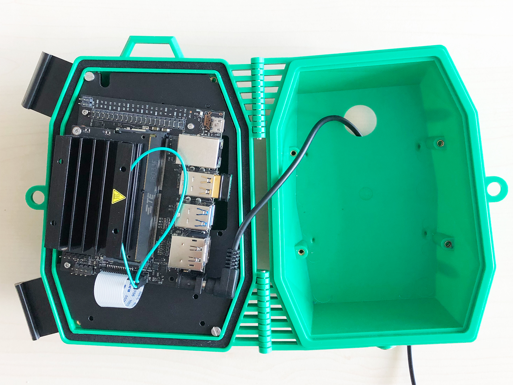
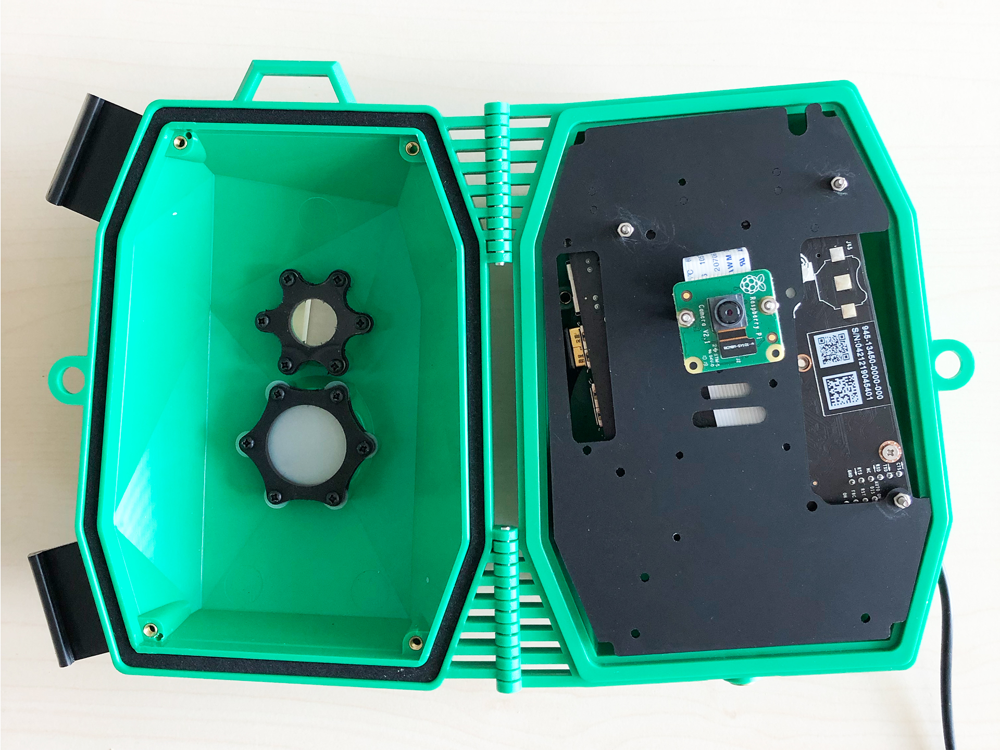
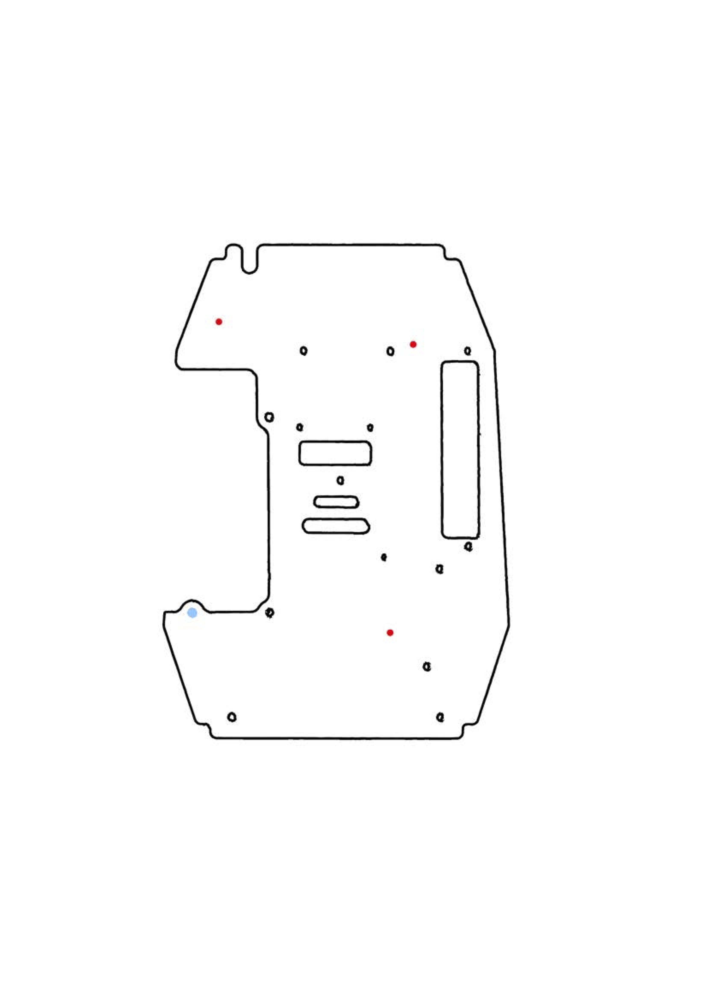
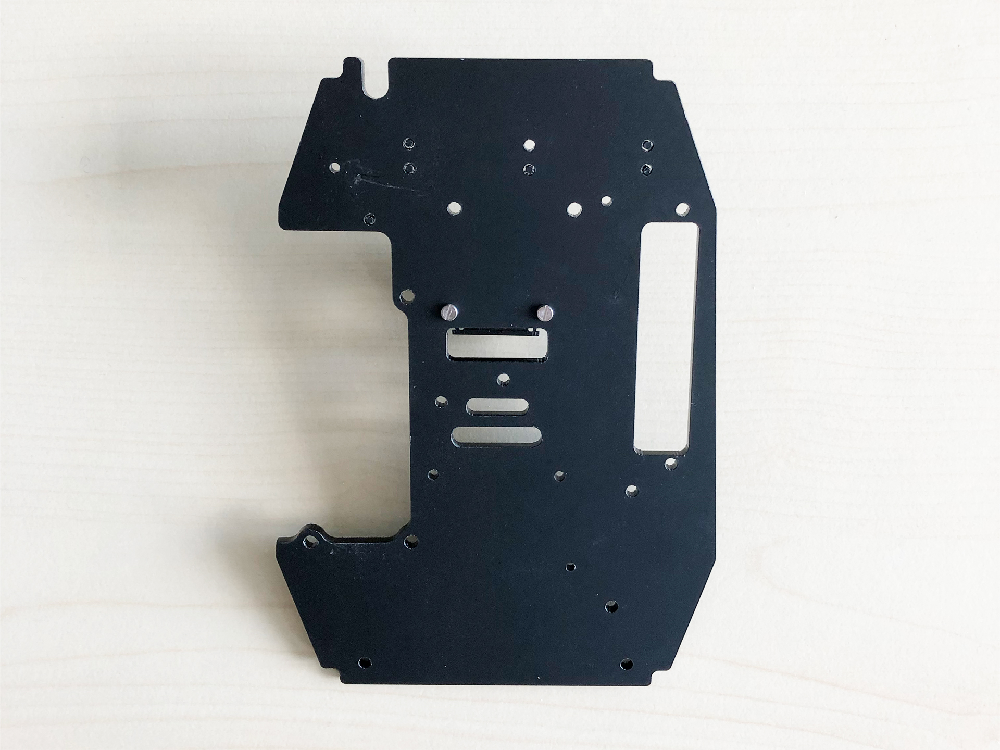
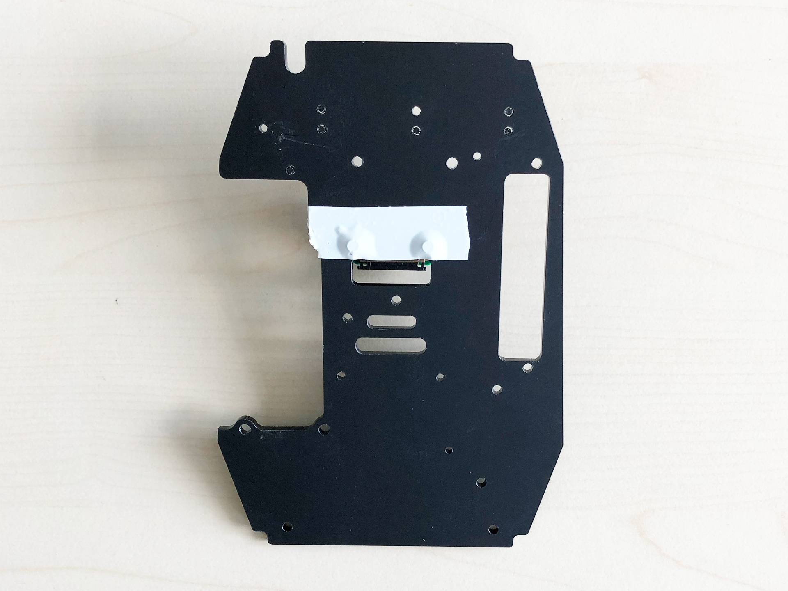
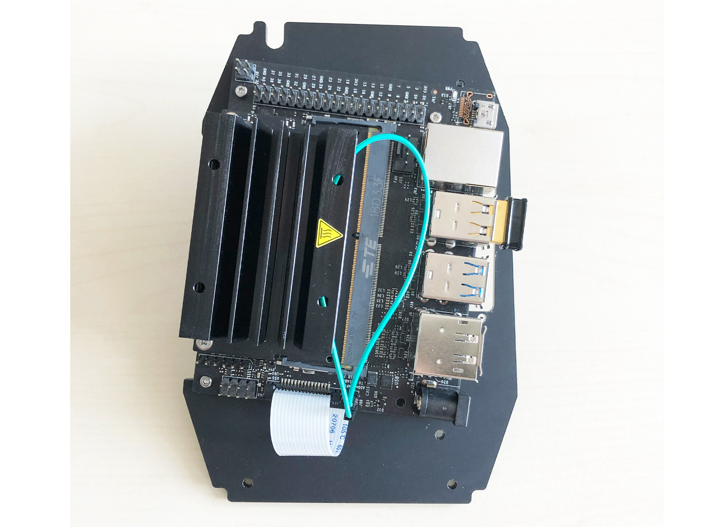
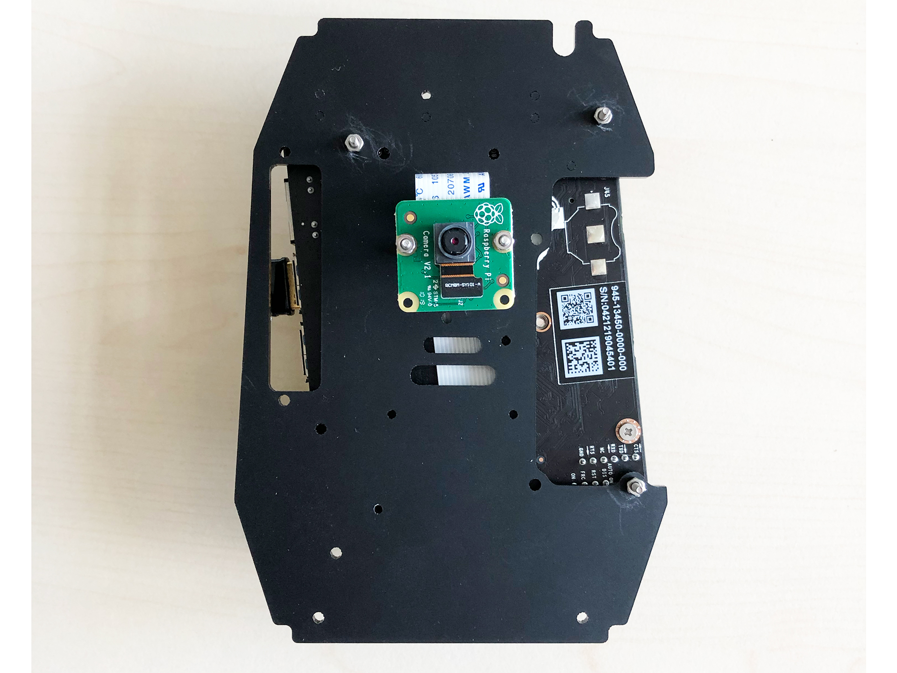
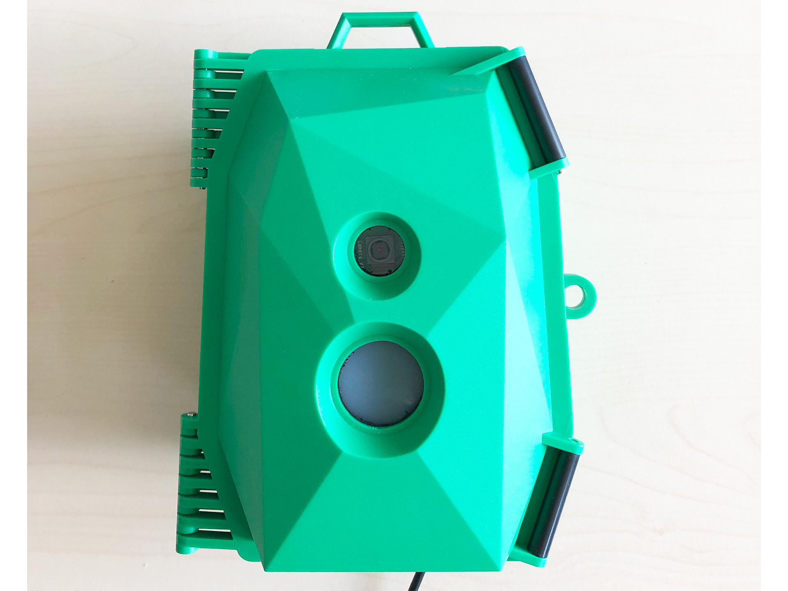
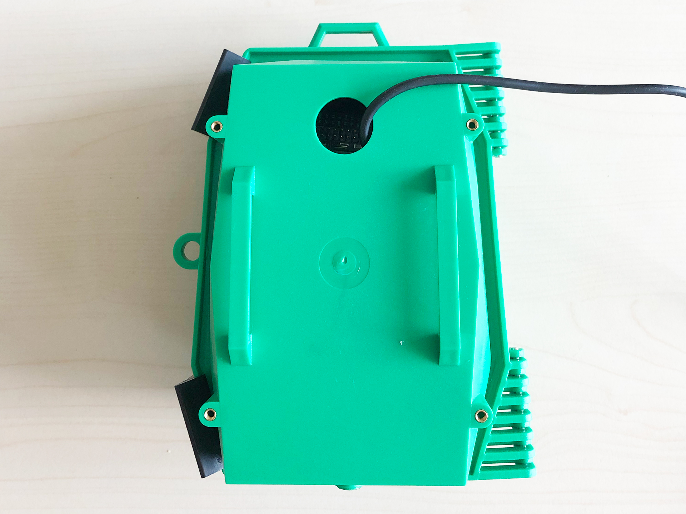

## Instructions

**Here are the steps to set up the Jetson NANO in the [Wildlife Cam Casing from Naturebytes](http://naturebytes.org/our-tech/).**

The casing is originally designed for the raspberry pi 3. The good thing is, that the form-factor of the nano board is not that different so with some simple modifications of the base plate, the Jetson board will fit in without any problems.

| Nano side                         | Cam side                         |
| --------------------------------- | -------------------------------- |
|  |  |

### Steps

#### One way to fit the board on the baseplate is:

- Print out the PDF file with the baseplate template
- Attach the print on the baseplate
- Drill the holes marked in red on the template (preferably with an 3mm bit since the screws used are M3s)

#### Another way is:

- Fix it with one thread screw on the existing hole (marked in blue in the baseplate template below)
- Rotate the board to the point where it fits perfectly on the baseplate.
- Mark your own holes in the locations (also marked in red in the baseplate template below).
- Once it fits, mark the spots for the hole and drill it with an electric drill (preferably with an 3mm bit since the screws used are M3s)

Make sure to leave some space for the power adapter since it takes a bit of space. ([Link to the adapter](https://www.amazon.de/gp/product/B004US2XPS/ref=ppx_yo_dt_b_asin_title_o02_s00?ie=UTF8&psc=1))

| Baseplate                                  | Print version                                 |
| ------------------------------------------ | --------------------------------------------- |
|  | [Baseplate PDF](../assets/nano_baseplate.pdf) |

- When installing the RaspiCam make sure to cover the screws with some electrical tape to prevent short circuits since the board will be mounted on the other side of the plate.

|                            |                           |
| -------------------------- | ------------------------- |
|  |  |

- After mounting the camera on the board you can place the board on the plate and fix it there with 4 thread screws (3mm) as seen on the pictures below

|                           |                          |
| ------------------------- | ------------------------ |
|  |  |

- The last step is to fix the baseplate on the casing with the included screws.

### Congrats you are finshed

|                           |                          |
| ------------------------- | ------------------------ |
|  |  |
